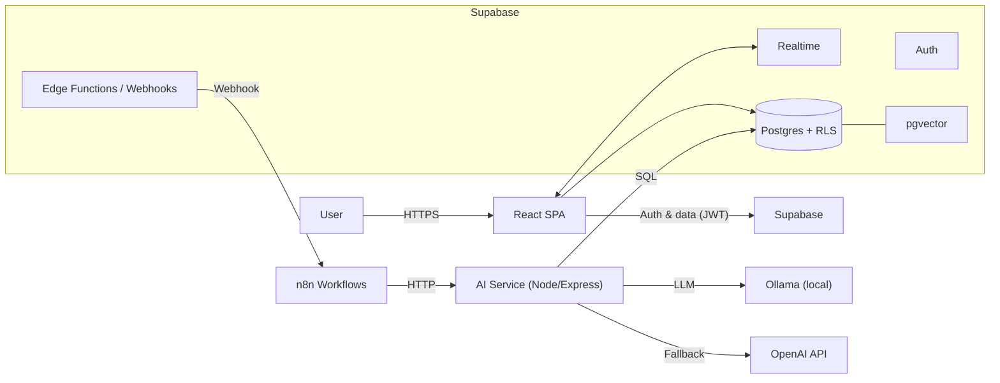
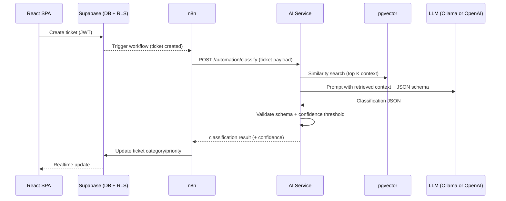

# ERP Ticketing SAV – Architecture

## Objective

Document system architecture and technical decisions.

## Purpose

Ensure project clarity and maintainability.

## Architecture diagram



## Stack decisions (and why)

- **Supabase (Postgres + Auth + RLS + Realtime)**: managed Postgres with database-enforced tenant isolation and first-class auth.
- **React + TypeScript**: fast UI iteration with type safety and a predictable component model.
- **pgvector**: vector search in Postgres (no extra infra) and co-locate RAG context with business data.
- **n8n**: orchestration for the ticket pipeline (retries, branching, visibility) without hard-coding workflow logic.
- **AI service (Node/Express)**: centralizes AI logic, schema validation, observability, and provider fallback.
- **Hybrid inference (Ollama primary, OpenAI fallback)**: cost/data control locally with a reliability backstop.

## RLS strategy explanation (multi-tenant isolation)

### Data model

- **Tenant boundary**: `organizations.id`
- **Membership**: `user_organizations(user_id, org_id)`
- **Business data**: `tickets.org_id` references `organizations.id`

### Enforcement model

- The frontend uses **Supabase anon key + user JWT**.
- Postgres applies **Row Level Security** to every query on protected tables.
- Policies constrain rows to `org_id` values that are present in the current user’s memberships (`auth.uid()`), preventing cross-tenant access even if the client is compromised.

### Minimal policy pattern (conceptual)

```sql
CREATE POLICY tenant_select ON tickets
FOR SELECT
USING (
  org_id IN (
    SELECT org_id
    FROM user_organizations
    WHERE user_id = auth.uid()
  )
);
```

### Automation note

For updates performed by automation (n8n / AI pipeline), use a **server-side credential** (e.g. service role key) stored only in the backend environment and never exposed to the browser.

## AI + RAG workflow

### What “RAG” means here

Use vector similarity (pgvector) to fetch the most relevant historical/support context for a ticket, inject that context into the model prompt, and request a structured classification output.

### End-to-end workflow



### Guardrails

- **Structured output validation**: reject non-JSON / out-of-enum outputs.
- **Confidence threshold**: low confidence triggers a fallback path.
- **Timeout + fallback**: if the model fails/times out, use rules or mark as “unclassified”.
- **Context limits**: cap retrieved chunks; never mix tenant data across orgs.

## n8n automation flow


### Responsibilities

- Trigger on “ticket created”
- Call AI service to classify
- Update ticket in Supabase
- Persist workflow execution logs (latency, failures, fallback usage)

### Recommended stages

- **Trigger**: webhook or Supabase Edge Function trigger
- **Validate**: webhook secret/signature + payload schema + idempotency key
- **Classify**: call `POST /automation/classify`
- **Update**: write `category`, `priority`, `confidence`, and any audit metadata
- **Notify (optional)**: alert on high priority or repeated failures

## Deployment overview

### Components

- **Frontend**: static React build (CDN / static hosting)
- **Supabase**: managed (Auth, Postgres, Realtime, Edge Functions)
- **n8n**: Docker container (secured; encrypted credentials)
- **AI service**: Docker container (internal network access)
- **LLM provider**: Ollama (same network) with optional OpenAI fallback

### Secrets + configuration boundaries

- **Browser-safe**: `SUPABASE_URL`, `SUPABASE_ANON_KEY`
- **Server-only**: `SUPABASE_SERVICE_ROLE_KEY`, `N8N_ENCRYPTION_KEY`, webhook secrets, `OPENAI_API_KEY`

## Security considerations

### AuthZ / tenancy

- Enforce access with **RLS** as the source of truth.
- Avoid “tenant checks only in the UI”; treat the client as untrusted.

### Automation hardening

- Protect n8n UI with auth; restrict network exposure; consider IP allowlists.
- Encrypt n8n credentials with `N8N_ENCRYPTION_KEY`.
- Use least-privileged server credentials per environment (dev/staging/prod).

### AI-specific risks

- **Prompt injection**: treat inputs as untrusted; constrain outputs; never execute actions based solely on model text.
- **Data leakage**: ensure RAG retrieval is tenant-safe; do not include secrets in prompts/logs.
